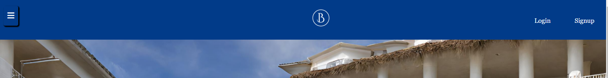

# Blue Hotel 

## Table of Contents

## User Experience (UX)

### User stories

#### First Time Visitor Goals

#### Returning Visitor Goals

### Design

1. Images

2. Colour Scheme

3. Typography

## Technologies used 

### Languages

- Python
- CSS 
- Javascript
- HTML

### Frameworks, Libraries & Programs Used

- Django [3.2.22]
- Cloudinary [1.34.0]
- Crispy Forms [1.14.0]
- Gunicorn [21.2.0]
- Github 
- Allauth
- Psycopg [2.9.7]
- Jest
- SQLAlchemy [1.4.46]

## Features

### Navigation Bar

The navigation bar appears at the top of all the webpages on this website and allows the user to login and shows the user if they are logged in or logged out on the top left.

### Menu Button

The menu button on the top left when clicked will overlay the page with a darker opacity and show 3 different options which the user can select to book a room or manage their bookings

### Hero image

The hero image shows the entrance of the hotel which align with the name of the website 

### Hotel Info

This section shows additional information and promotional information about the hotel and is meant to show off the facilities and how the hotel looks

### Footer

## Testing 

### Responsiveness

### Browser compatibility

### Validator Testing

1. HTML

2. CSS

3. Javascript

### Fixed bugs

### Unfixed bugs

## Deployment

## Credits

### Images

### Videos 

### Code