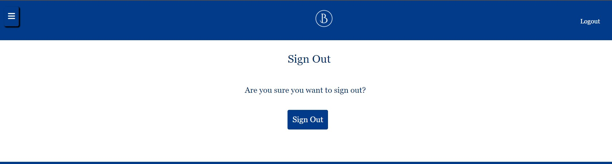
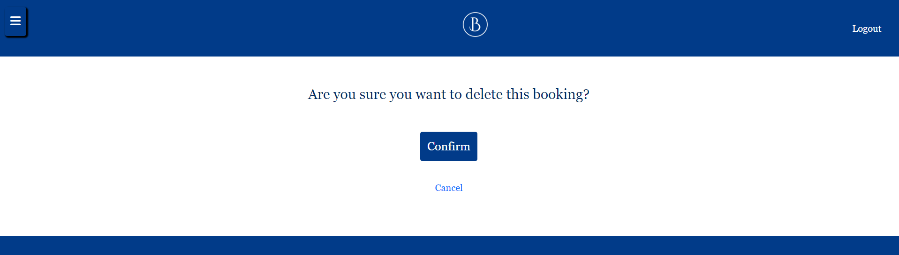

# Blue Hotel 

This is a website for the Blue Hotel Beach Resort located in Cueno, Italy. This resort is located on the west cost of northern Italy and offers many luxurious services. The Blue Hotel offers a pay at check-in services in which the booking can be made stress free and customers can pay at the hotel reception at check-in. This website hopes to advertise the hotel services and allow users to create bookings. Customers can navigate the website,create bookings, and manage their bookings to view or change their existing bookings. 

## Table of Contents

- [User Experience (UX)](#user-experience--ux-)
- [Technologies used](#technologies-used)
- [Features](#features)
- [Testing](#testing)
- [Deployment](#deployment)
- [Credits](#credits)

## User Experience (UX)

### User stories

#### First Time Visitor Goals

- First time users should have a fast understanding of the purpose of the website 
- First time users should be able to navigate to around the website and create and manage bookings
- First time users should be able to understand login requirements to access certain features

#### Returning Visitor Goals

- Returning users should be able to login into their account 
- Returning users should be able to view their existing bookings 
- Returning users should be able to update and delete their existing bookings 

### Design

1. Images

All images are made using Canva AI and are all 'pictures' of different parts of the hotel including the entrance and they all are on theme.

2. Colour Scheme

The colors were chosen to relate to the name and the style/theme of the hotel but still keep it luxurious with the shade of white.

3. Typography

The Georgia font family was chosen to suite the beach theme of the hotel but also still maintain the luxurious theme of the hotel.

## Technologies used 

### Languages

- Python
- CSS 
- Javascript
- HTML

### Frameworks, Libraries & Programs Used

- Django [3.2.22]
- Cloudinary [1.34.0]
- Crispy Forms [1.14.0]
- Gunicorn [21.2.0]
- Github 
- Allauth
- Psycopg [2.9.7]
- Jest
- SQLAlchemy [1.4.46]
- Boostrap [5.3.2]

## Features

### Navigation Bar

The navigation bar appears at the top of all the webpages on this website and allows the user to login and shows the user if they are logged in or logged out on the top left.

### Menu Button

The menu button on the top left when clicked will overlay the page with a darker opacity and show 3 different options which the user can select to book a room or manage their bookings

### Hero image

The hero image shows the entrance of the hotel which align with the name of the website 

### Hotel Info

This section shows additional information and promotional information about the hotel and is meant to show off the facilities and how the hotel looks

### Footer

The footer is located at the bottom of all of the webpages on this website and it shows the customer the location, phone number, and the copyright so that customers can contact the hotel for further information or enquires

### Login page

The login page allows an existing user to login to their account and is required to create a booking or view existing ones

### Logout

The logout page asks for confirmation to logout of the account if the user wants to sign in to a different account or any other need

### Create Booking

This page allows only a logged in user to fill out the form and create select their dates to book a hotel room under a certain name and associate it with that account. The page then redirects to manage booking page to show that their booking went through.

### Update Booking

When the user is logged in and in their manage booking page they can choose to update their booking to modify any part of their existing booking

### Delete Booking

When the user is logged in and in their manage booking page they can delete their booking based on their circumstance which will redirect them to a page to confirm they want to delete the booking

### Manage Booking

This page can be accessed from the menu button in the home page when the user is logged in. It shows the existing bookings the user has made and the check-in and check-out days and the date in which the booking is occurs. The page also presents links to delete or update an existing booking

## Testing 

### Responsiveness

The website is adapted to be seen on different screen sizes. 
The responsiveness of the website was first tested by chrome developer tools. 
Different breakpoints where used to view the website. 
Next to this the website was viewed on different devices: laptop, tablet and smartphones.

### Browser compatibility

The website was tested in different browsers. 

|Browser| compatibility|
|------------------------------------|-------------|
|Mozilla Firefox version 119.0 |no problems|
|Microsoft Edge Version 118.0.2088.76 |no problems|
|Google Chrome Version Mac OS 118.0.5993.117 | no problems|

### Validator Testing

1. HTML

2. CSS

3. Javascript

### Fixed bugs

- The create booking form used to throw an error whenever a non-logged in user tried to submit. It was fixed by redirecting to sign in page if the user clicks the book a room link and isn't logged in.
- Django version occassionally automatically updated and Postgress wasn't copatible with that version. Django was uninstalled and re-installed with the correct version

### Unfixed bugs

- When choosing the room type it allows it shows '----' as an option but the form does not accept '----' as a valid input
- In the 'Manage Your Bookings', if there is more than one booking the first booking will have a double outline compared to the second.

## Deployment

This site was deployed using Heroku

1. To deploy to heroku it is required to create env.py file and make a 'secret key' and connect the ElephantSQL database and Cloudinary database. (Make sure env.py is ignored)

2. Configure settings.py so that it contains all of those urls and secret key

3. Create Heroku App and in settings insert the keys and values in the config vars

4. On Heroku go to deploy and connect to the project with github, select the project, and below click deploy.

Live link : https://bluehotel-31aa453a87a4.herokuapp.com/ 

## Credits

### Images

- All images where generated using [Canva](https://www.canva.com/ai-image-generator/)